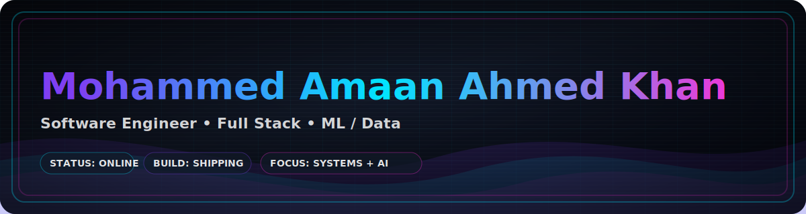

<!-- =========================
     Amaan Khan | GitHub Profile
     ========================= -->

<!-- Banner (Option A: Capsule Render) -->

  

<!-- Typing tagline -->

  

<!-- Quick links -->

  <a href="https://linkedin.com/in/amaankhan2000/"><b>LinkedIn</b></a> •
  <a href="mailto:mkhan226@asu.edu"><b>Email</b></a> •
  <a href="https://github.com/AmaanKhan2000"><b>GitHub</b></a>

<!-- Badges -->

  
  
  

---

## 🎮 Player Card

**Class:** Software Engineer (Full Stack + ML Systems)  
**Main Quest:** Build production-grade apps that blend **systems + data + AI**  
**Side Quest:** Secure identity systems (**OAuth2/OIDC, SSO, RBAC, MFA**)  
**Location:** Tempe, AZ

### 🧪 EXP Bar
> Progress to “Next Level”: ██████████░░░░░░░░ 65%

---

## 🧠 Skill Tree (Modern Bars)
> Self-rated based on real usage in work/projects.

<!-- =============== Languages =============== -->
### Languages

  <b>Python</b> 
  
  

  <b>JavaScript / TypeScript</b> 
  
  

  <b>Java</b> 
  
  

  <b>SQL</b> 
  
  

  <b>C#</b> 
  
  

  <b>C / C++</b> 
  
  

  <b>Julia</b> 
  
  

---

<!-- =============== Frameworks / Systems =============== -->
### Frameworks / Systems

  <b>React</b> 
  
  

  <b>FastAPI / Flask</b> 
  
  

  <b>Node / Express</b> 
  
  

  <b>Docker / Kubernetes</b> 
  
  

---

<!-- =============== ML / Data =============== -->
### ML / Data

  <b>pandas / NumPy</b> 
  
  

  <b>scikit-learn</b> 
  
  

  <b>LLMs / RAG</b> 
  
  

  <b>TensorFlow</b> 
  
  

---

## 🏗️ Featured Builds

### 🔥 Parallel API Test Runner (Multi-tenant)
**Python • C# • Multi-threading • REST**  
- Runs tenant-specific tests in parallel, validates containerized APIs, logs failures centrally.

### 🤖 RAG Chatbot (LLM + Vector Search)
**Python • LangChain • Streamlit**  
- Context-grounded responses, tuned embeddings, evaluation-focused.

### 🛣️ Road Scene Segmentation (DeepLabv3+)
**TensorFlow • Cityscapes**  
- Semantic segmentation + optimization for faster inference.

---

## 🌐 Connect with me

  
  
  

---

## 🧰 Tech Arsenal (Languages & Tools)

### 👨‍💻 Languages

  
  
  
  
  
  

### 🧩 Frameworks & Libraries

  
  
  
  
  
  
  
  
  

### ☁️ Cloud / DevOps / Tooling

  
  
  
  
  

### 🗄️ Databases

  
  
  

---

## 📊 Stats & Dashboard (Dark Minimal)

<!-- Small dark badge row -->

  
  
  

<!-- Dashboard tiles (like your photo) -->

  

  
  

  
  

<!-- Optional streak -->

  

---

## 🐍 Mini-Game: “Snake Eats My Contributions”

  

---

  <i>Prototype it. Build it. Ship it. Level it up.</i>

