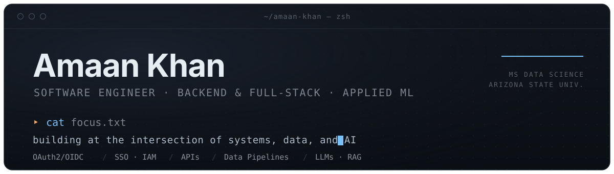

  

  
  
  

 

## About

Software Engineer focused on backend systems, full-stack applications, and applied ML. Currently pursuing an MS in Data Science &amp; Analytics at Arizona State University.

I build at the intersection of solid systems and data — APIs, identity and access platforms, data pipelines, and production-grade ML/RAG. I care about clean architecture, observability, and shipping things that hold up under real load.

 

## Stack

**Languages**
 

**Backend &amp; Infrastructure**
 

**Frontend &amp; ML**
 

 

## Selected Projects

<table>
<tr>
<td width="50%" valign="top">

**Parallel API Test Runner**
 Python · C# · Multithreading · REST

Multi-tenant runner that validates containerized APIs in parallel and centralizes failure logging.

</td>
<td width="50%" valign="top">

**RAG Chatbot**
 Python · LangChain · Streamlit

Context-grounded Q&amp;A over a vector store with tuned embeddings and an evaluation-focused workflow.

</td>
</tr>
<tr>
<td width="50%" valign="top">

**Road Scene Segmentation**
 TensorFlow · DeepLabv3+

Semantic segmentation on Cityscapes with inference optimization for lower latency.

</td>
<td width="50%" valign="top">

**More on GitHub**
 Pinned repositories

A mix of systems, data, and ML work — see the pinned repos below for the full picture.

</td>
</tr>
</table>

 

## GitHub

  
  

  Prototype it · build it · ship it

